## 英語でオープンソース開発の すすめ

---

---
## 誰？ / 今日話すこと

名前： 矢野勉
* 京都で会社やってます。
* UBでも仕事してます。

---
## 仕事

<table border="0">
<tbody>
<tr>
<td>
書いた本 
 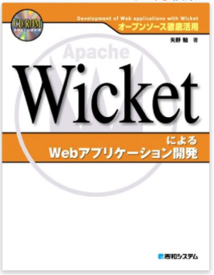
 </td>
 <td>
 手伝った本 
 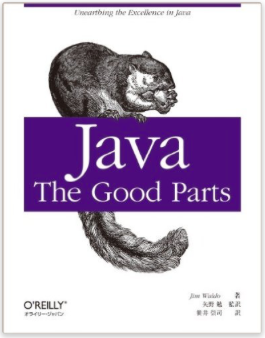
 </td>
 </tr>
 <tr>
 <td colspan="2">
 作ったサービス 
https://shelfmap.com/
</td>
 </tr>
 </tbory>
 </table>

---
最近、Clojureプロジェクトにソース提供したのでその話をします。

---
## オープンソース開発に 参加してますか？

今は、オープンソース開発に ものすごく参加しやすい時代になりました

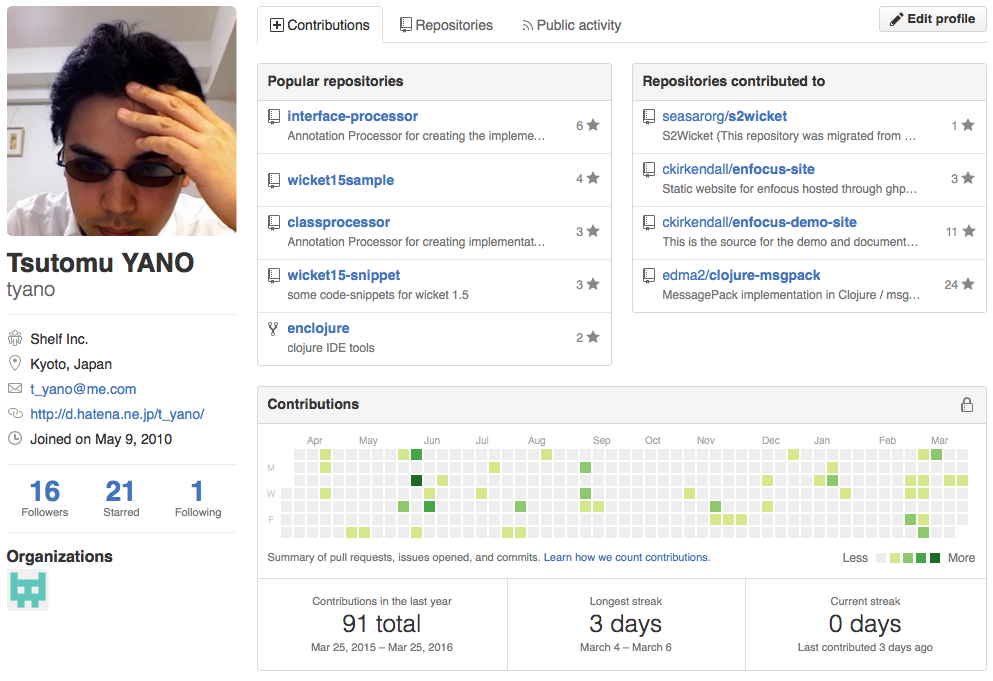

---
## Githubでの開発参加

* issue登録→議論
* Pull Request→マージ

---
## プルリクエスト

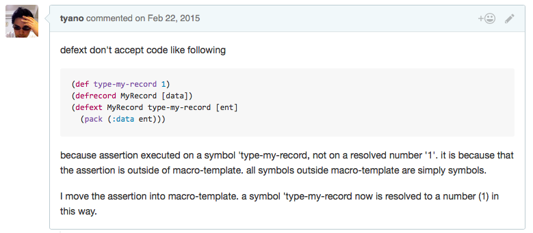

---
## プルリクエスト

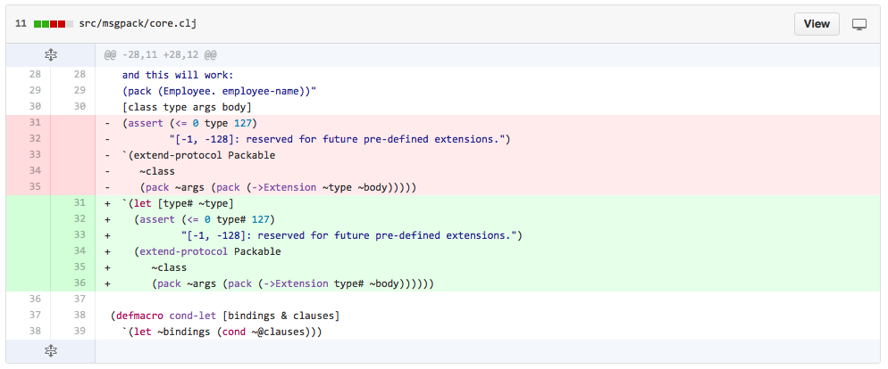

---
## ちゃんとしたコードなら マージされます

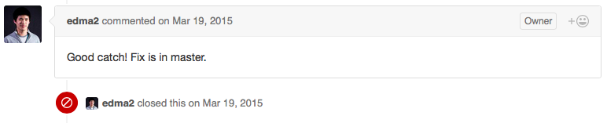

---
## 大規模プログラムの開発は ちょっと異なる

* 品質管理
* ユーザー数多すぎ
* ソフトウェアの法的保護

---
## Clojure（言語）の場合

* メーリングリスト
* JIRA
* パッチ登録
* プルリクエストを使わない（Clojure開発者にとってパッチファイルの方が楽なため）

---
## 実体験

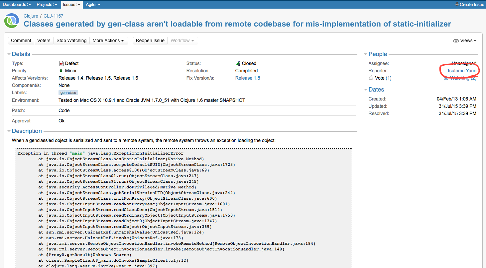

---
## Clojureプロジェクトへの参加

Contributing to Clojure
http://clojure.org/community/contributing

* JIRAアカウント作成
* dev@clojure.orgで議論（必要なら）
* Contributor Agreementへの（物理的）サイン
* JIRAへパッチ登録

---
## Contributor Agreement

今はeSignで簡単（前は郵送かFAXでした）

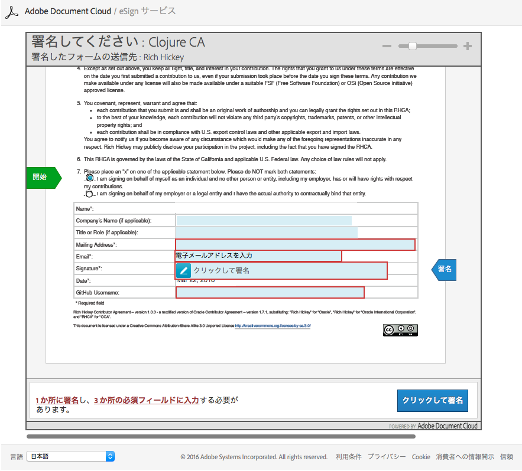

---
## 最後は Rich Hickey が決める

Rich Hickey  
↑  
Screener  
↑  
Contributer

---
## Rich に辿り着くまでの道のり

JIRA workflow
http://dev.clojure.org/display/community/JIRA+workflow

* *None* - 新チケット。contributorがチケットを作った直後はこれ。
* *Triaged* - screenerがこのチケットは作業対象となるべきと判断した
* *Prescreened* - screenerがチケットを承認し、レビューに回すためにパッチを検査した

---
## Rich に辿り着くまでの道のり

* *Vetted* - screenerとRichがこのチケットは作業されるべきと判断した
* *Screened* - screenerがパッチをチェックしてRichのレビューに回してよいと承認した
* *Incomplete* - screenerはパッチが不十分と見て、contributorへ改善を要求した
* *Ok* - Richがこのパッチを次期Clojureリリースに入れると承認した

---
## BDFL (Benevolent Dictator For Life)

「優しい終身の独裁者」システム

* Guido van Rossum (Python)
* Linus Torvalds (Linux)
* まつもとゆきひろ (Ruby)

---
## パッチ提供者

Richが承認したパッチはClojure本体にマージされます
サイトの「パッチ提供者」リストに名前が永久に残ります
現在137名

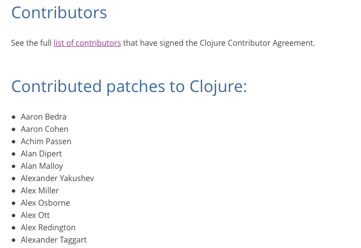

---
## パッチ提供者

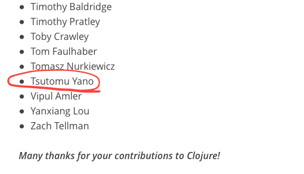

---
## 英語（の「壁」）

* インターネットでオープンソース活動に参加するなら、英語（読み書き）は必要です
* 残念ながら「壁」とか余裕もった言い方してる時間はなくなります
* でもそんなに怖くないです

---
## Javadoc危機

Java8の日本語Javadocは一度なくなると言われたことがありました

---
## 世界は加速している

OSSの開発スピード＞翻訳スピード

---
## 翻訳が追いつかない

実は原書の方もおいついてないくらいなので。  

オライリーのClojure Programming
 ↓
 Clojure 1.4ベース（現在1.8）

---
## 日本語翻訳は ほんとにでるだろうか？

* Java 9のJavadocは翻訳されるだろうか？
* 日本語Javadocがなかったらそのバージョンは採用しないんだろうか？
* 日本語本が出てないとその技術は採用しないんだろうか？

---
### これらが全部ちゃんと翻訳される？

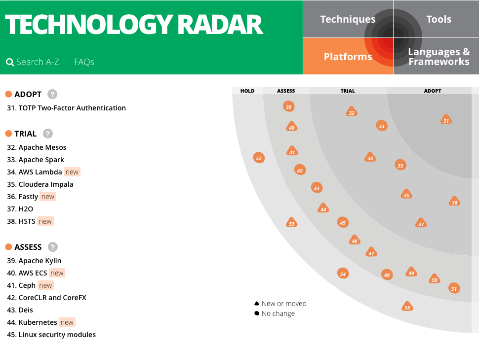

---
### これらが全部ちゃんと翻訳される？

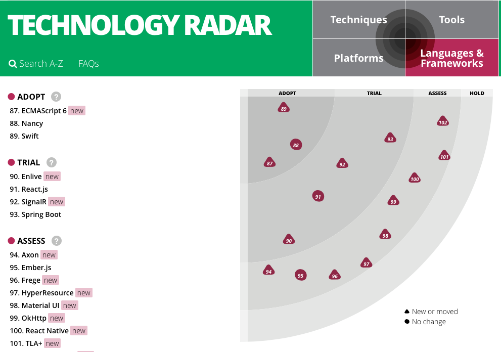

---
## 加速した結果

---
### 小振りな本がたくさん出るようになった

* Clojure Applied (238ページ）
* Clojure Reactive Programming （232ページ）
* Clojure For Finance （188ページ）

おそらくこれも、変化が早くなった影響  
でもその分、一冊を読むのが楽になった  

これで「読む」方は入りやすくなった

---
## Githubはコードで参加するSNS

プログラマはコードで語ればいいので「ちゃんとした」英語書くより参加しやすいです  
あなたが困ってることは、たぶん他の人も困ってます

---
## ただしく報告を

「ちゃんとした」英語を書くのにがんばるなら、そこは適当にしてでも、「ちゃんとした」バグレポートを書こう
---
* どうやったら再現できるの？
* 簡単に再現できるプログラムはある？
* どういうユースケースを想定しているの？
* パッチを適用した状態でテストを全実行した？

---
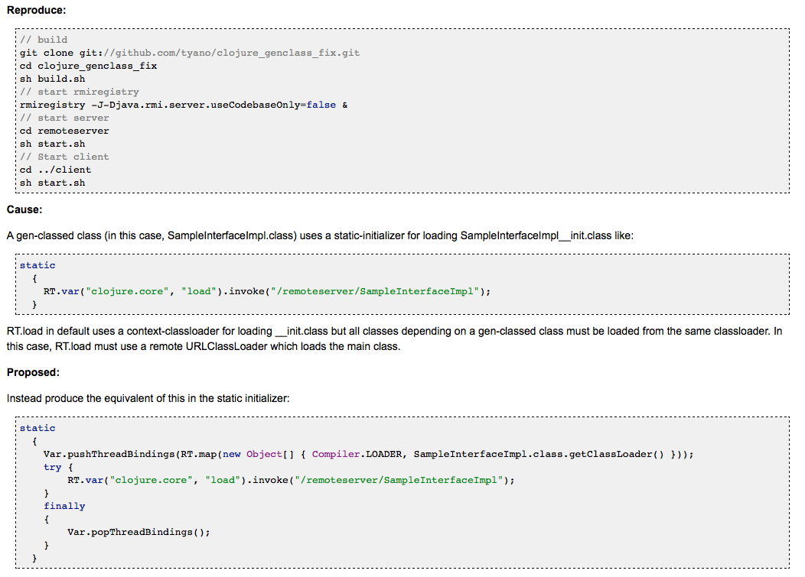

---
正しいコードは（レポートの英語の文法が間違ってても）ちゃんと採用されます

---
## 英語チケットを経歴にする

経歴書に、いままでにパッチを書いて採用された  
チケットのURLを貼っていいんです。

他者にチェック＆承認された、  
ほんものの実績になります

---
## 外国語をやるなら 自分の好きなことでやるのが一番

プログラミング、すきじゃないですか？

趣味と実益を兼ねよう

---
# Q&A
